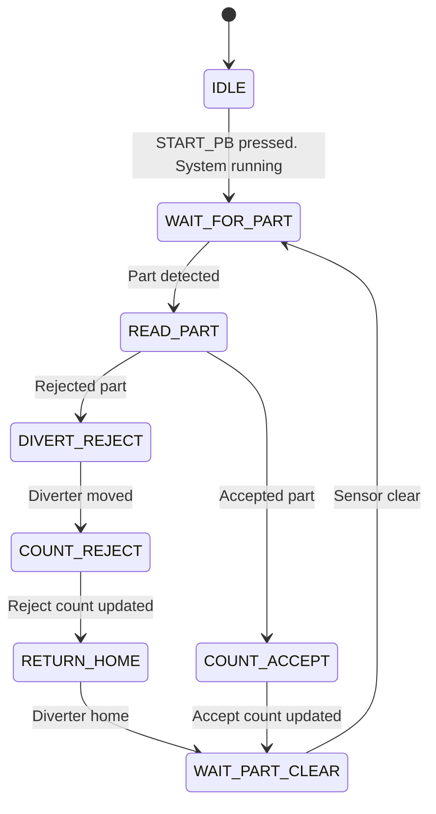

# State Machine

This document describes the control logic for the Arduino Mini Sorting System.

The sorter uses a state-machine approach so that each physical part is handled once per cycle. This helps prevent false counts, double detection, and actuator timing problems.

---

## State Machine Diagram

---

## State Descriptions

| State | Purpose |
|---|---|
| `IDLE` | Initializes LCD, servo position, counters, and sensor settings. |
| `IDLE` | Waits for a part to enter the sensor area. |
| `WAIT_FOR_PART` | Reads the reflectivity sensor value. |
| `READ_PART` | Compares sensor value against threshold ranges. |

| `DIVERT_REJECT` | Begins logic for routing a white part. |
| `RETURN_HOME` | Moves the servo/diverter to the black-part path. |
| `MOVE_DIVERTER_WHITE` | Moves the servo/diverter to the white-part path. |
| `COUNT_ACCEPT` | Increments the black-part counter. |
| `COUNT_REJECT` | Increments the white-part counter. |
| `WAIT_PART_CLEAR` | Waits until the sensor area is clear before accepting another part. |
| `NO_PART` | Handles readings that indicate no part is present. |
| `ERROR` | Handles readings outside expected threshold ranges. |

---

## Why This State Machine Matters

The sorter should not simply check the sensor value repeatedly inside the Arduino loop and count every matching reading.

Because the Arduino loop runs many times per second, one physical part could be detected multiple times.

The `WAIT_CLEAR` state solves this by requiring the system to see an empty sensor condition before returning to `IDLE`.

---

## Basic Logic Flow

1. System initializes.
2. System waits for a part.
3. Sensor reading is captured.
4. Reading is classified as black, white, empty, or error.
5. Servo moves diverter to the correct position.
6. Count is updated.
7. System waits for the part to clear the sensor area.
8. System returns to idle.

---

## Threshold Logic

Exact threshold values still need to be measured and confirmed during calibration.

Planned categories:

| Condition | Sensor Reading Range | Action |
|---|---:|---|
| Empty / no part | TBD | Return to idle |
| Black part | TBD | Route to black bin |
| White part | TBD | Route to white bin |
| Unknown / unstable | TBD | Ignore or flag error |

---

## Future Improvements

- Add debounce/filtering for noisy sensor readings.
- Record actual measured sensor values.
- Add timeout behavior if the sensor never clears.
- Add LCD messages for each state.
- Add serial monitor debugging output.
- Add error handling for unexpected readings.